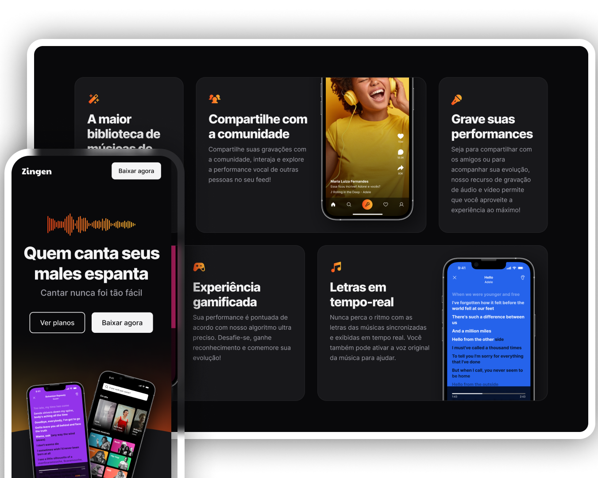

# Projeto Zingen - Karaokê

## 🚀 Tecnologias
Esse projeto foi desenvolvido com as seguintes tecnologias:
- HTML
- CSS
## 💻 Projeto
Trata-se de um website de karaokê, onde o usuário pode escolher uma música e cantar junto com a letra. 
O projeto foi desenvolvido durante o curso de Full-Stack da Rocketseat.

## 📺 Layout
